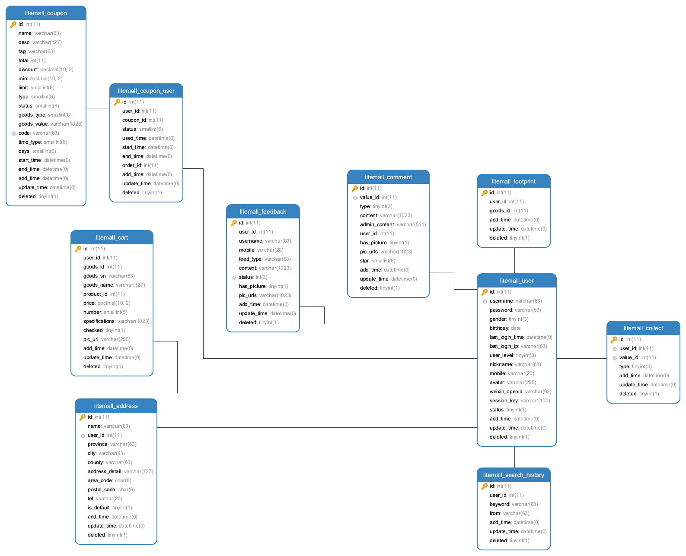

# 数据库

警务云数据库使用的是oracle数据库，还有部分接口数据来源于各种的xlsx文档文件。
数据库并没有进行表结构设计，目前数据库表关系和说明较为混乱，待完善:

* 整理表关系；
* 规范表名，说明表的作用、字段的意义；
* 减少无意义、语义不清的表和字段；
* 字段类型、大小需规范合理，不能滥用；

## 1 数据表结构

### 1.1 前台相关

* 待完善
<!---->

### 1.2 管理系统相关

* 待完善

### 1.3 其他

* 待完善

## 2 数据表设计

接下来讨论一些数据表的关键细节。

### 2.1 申请流程配置设计

这里申请流程配置存在流程配置表（TB_WFM_WORKFLOW），流程配置环节表（TB_WFM_WORKFLOWMODEL）

流程配置表是流程配置的基本信息，主要包括流程配置名称，警种，创建人，说明等；

流程配置环节表是记录了流程配置内每个环节的信息，主要包括配置内的环节名，环节处理人，环节参与人，下个环节的标识等；

流程配置和环节是一对多关系，每个流程有多个环节，这里申请流程配置的环节设置是固定的，环节分别是申请、本单位审批、服务台复核、大数据办审批、业务办理。

以下是一些细节的讨论：

* 目前设计中，在管理系统-申请流程配置-新增时，接口对数据保存，会新增一个流程配置表记录、五个流程配置环节记录；环节中的环节名并不会从前端传入，由系统逻辑写死，处理人由前端传入，每个环节记录上一个环节主键标识，逻辑维护环节顺序；

注意：

> 新增流程配置表记录时，如果检查到当前流程配置并非默认流程状态，则会处理旧默认流程，所有非本流程的旧流程默认标志置为空（含逻辑删除的默认流程）

### 2.2 IPDS四类资源一键申请设计

如下使用IAAS的容器服务申请示例流程进行说明

一键申请存在应用信息表（TB_APPLICATION_INFO），购物车表（TB_SHOPPING_CART），流程活动表（TB_WFM_ACTIVITY），流程实例表（TB_WFM_INSTANCE），流程配置表（TB_WFM_WORKFLOW），流程配置环节表（TB_WFM_WORKFLOWMODEL）

当选择容器服务，加入购物车，并提交申请后，会清除购物车相关信息，将应用信息保存到应用信息表，新增流程活动表和流程实例表数据，把流程配置和申请的应用信息关联起来。如果没有流程配置，则无法进行应用申请提交。

### 2.3 行政区域设计
 
litemall_region表保存了行政区域信息，包括省级、市级、县级三个等级，

原nideship.sql中存在region数据，但是litemall.sql的region数据则来自
[Administrative-divisions-of-China](https://github.com/modood/Administrative-divisions-of-China)项目。

